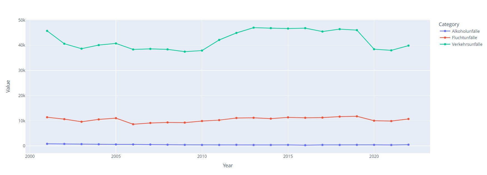
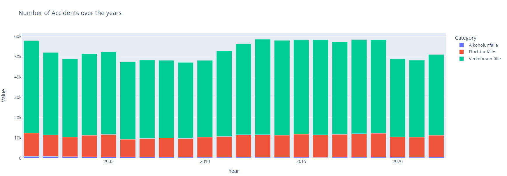

# NxtGen_AcciVision

NxtGen_AcciVision or Next Generation Accident Forecaster helps in forecasting the future accidents. This is project is part of a Digital Product School Challenge. The challenge consist of 3 parts:
1. Mission 1: Create a AI Model
2. Mission 2: Publish your source code & Deploy
3. Mission 3: Post the URL to the endpoint

## Demo
The application can be viewed in this [link](https://nxtgenaccivision.streamlit.app/) or the API endpoint `sree1996.pythonanywhere.com` can be used to get the predictions.
Note: The endpoint only accepts a POST request with a JSON body
```
{
"year":2020,
"month":10
}
```
And it return the applications prediction in the following format:
```
{
"prediction":value
}
```

## Data Description
The dataset used is "Monatszahlen Verkehrsunfälle" which is the Dataset from the [München Open Data Portal](https://opendata.muenchen.de/dataset/monatszahlen-verkehrsunfaelle/resource/40094bd6-f82d-4979-949b-26c8dc00b9a7). The features used for the forecast are:
1. Category
2. Accident-type
3. Year
4. Month
5. Value

## Mission 1: Create a AI Model
As the first step the exploratory data analysis was done. I made use of [pycaret](https://pycaret.org/) package to train the model. The main advantage is that it runs all the possible model and provides a comparitive analysis of the different machine learning models. The data set had data from year 2000 to 2024. To build the prediction model, data up until 2020 was used. Due to the limited features and limited data available Meta model Prophet or other time series model like ARIMA, SARIMA were not used. 

## Mission 2: Deploy AI model
To deploy the AI model [Streamlit Community Cloud](https://docs.streamlit.io/deploy/streamlit-community-cloud) was used. The endpoint was setup using [PythonAnywhere](https://www.pythonanywhere.com/) as streamlit cloud does not support endpoint creation. The successfulness of the endpoint was verified with the help of [Thunder Client](https://www.thunderclient.com/).

## Mission 3: Post the URL to the endpoint
The final step was to post a request to the challenge endpoint with the a given body format.

## Tec Stack Used
1. [Flask](https://flask.palletsprojects.com/en/3.0.x/)
2. [streamlit](https://streamlit.io/)
3. [pycaret](https://pycaret.org/)
4. [pandas](https://pandas.pydata.org/)
5. [numpy](https://numpy.org/)
6. [matplotlib](https://matplotlib.org/)
7. [seaborn](https://seaborn.pydata.org/)
8. [scikit-learn](https://scikit-learn.org/stable/)

## EDA and Result
In the EDA, visualization plots were created in order to understand the underlying pattern of the categories and accident types over the years.
1. The below plot looks into the total number of different accidents type over the years 
  <p align="center">
    
  </p>
  <p align="center">
      <b>Total Number of accidents over the years</b> 
  </p>
  
  <p align="center">
    
  </p>
  <p align="center">
      <b>Total Number of accidents over the years</b> 
  </p>

2. 
   <p align="center">
    
  </p>
  <p align="center">
      <b>Number of accidents with the respective category type</b> 
  </p>

3. 
  <p align="center">
    
  </p>
  <p align="center">
      <b>Number of rows with the different accident type</b> 
  </p>

4. 
  <p align="center">
      
    </p>
    <p align="center">
        <b>Number of accidents due to Alkoholunfälle over the months</b> 
  </p>

5. 
  <p align="center">
    
  </p>
  <p align="center">
      <b>Number of accidents due to Fluchtunfälle over the months</b> 
  </p>

6. 
  <p align="center">
    
  </p>
  <p align="center">
      <b>Number of Verkehrsunfälle due to Fluchtunfälle over the months</b> 
  </p>

Below table shows the evaluation metrics of the ML Models:

| ML Model      | MAE                                          | MSE | 
| Random Forest Regressor| 65.48 | 14786.62 |
| Extra Trees Regressor | 63.51 | 14823.22 |
| LightGBM | 74.59 | 15573.68 |
| XGBoost | 73.53 | 16806.41 | 


